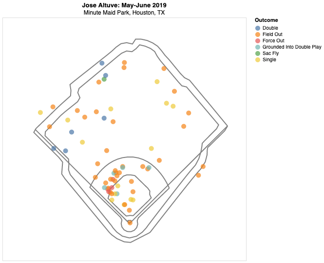
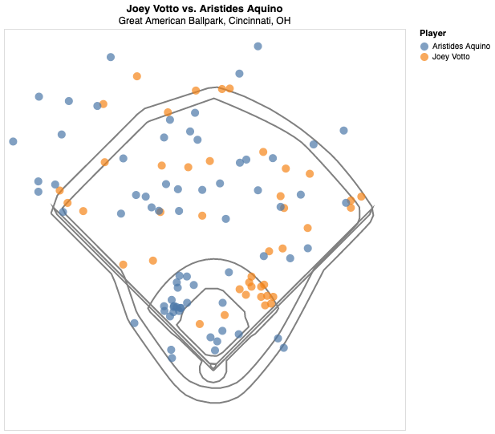

# Plotting

`plot_stadium(team)`

Plot the outline of a specified team's stadium using MLBAM coordinates

## Arguments

`team`: name of the team whose stadium you're plotting. Acceptable inputs:
* `angels`
* `astros`
* `athletics`
* `blue_jays`
* `braves`
* `brewers`
* `cardinals`
* `cubs`
* `diamondbacks`
* `dodgers`
* `generic`
* `giants`
* `indians`
* `mariners`
* `marlins`
* `mets`
* `nationals`
* `orioles`
* `padres`
* `phillies`
* `pirates`
* `rangers`
* `rays`
* `red_sox`
* `reds`
* `rockies`
* `royals`
* `tigers`
* `twins`
* `white_sox`
* `yankees`

`spraychart(data, team_stadium, title='', tooltips=[], size=100, colorby='events', legend_title='', width=500, height=500)`

## Arguments

`data`: Statcast data containing at the minimum `hc_x`, `hc_y`, and `events`. Any additional data you want included in the tooltips needs to also be included

`team_stadium`: name of the team whose stadium you want the hits overlaid on. Acceptable inputs are the same as above

`title`: title for your chart

`tooltips`: list of tooltips to include in the chart

`size`: size of the marks on the spraychart

`colorby`: which category in the data to use when color-coding the marks. By default will use the `events` variable. If there are multiple players in your data, use `player` to give each player their own unique color.

`legend_title`: optional arugment to change the title of the legend

`width`: width of the plot

`height`: height of the plot

# Example

```python
from pybaseball import statcast_batter, spraychart


data = statcast_batter('2019-05-01', '2019-07-01', 514888)
sub_data = data[data['home_team'] == 'HOU']
spraychart(sub_data, 'astros', title='Jose Altuve: May-June 2019')
```


```python
votto_data = statcast_batter('2019-08-01', '2019-10-01', 458015)
aquino_data = statcast_batter('2019-08-01', '2019-10-01', 606157)
data = pd.concat([votto_data, aquino_data])
home_data = data[data['home_team'] == 'CIN']
```
